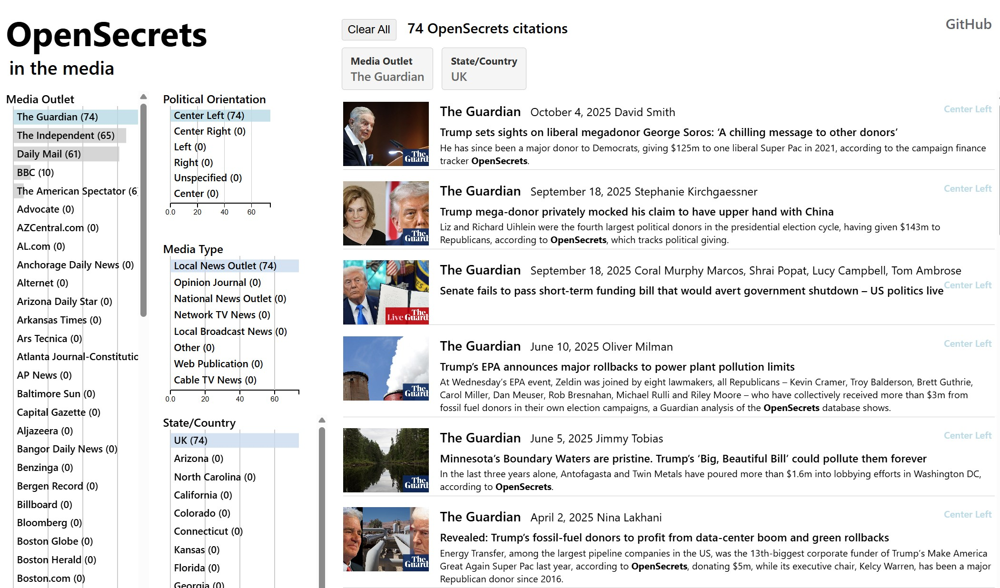

# OpenSecrets Press

A site to and find where OpenSecrets' research has been cited and get a sense of the scope of OpenSecrets' impact

[**View Live Site**](https://smckissock.github.io/open-secrets-press/)

### Data Management
- Uses the MediaCloud api to access OpenSecrets press coverage
- Incorporates manually entered information about media outlets from a Google Sheet - media outlet type, state/country and political orientation 
- Newspaper3k python library to extract text, photo URL, etc for each story
- spaCy to split story text into sentences
- DuckDB to store raw data, host a snowflake schema, and output a view as a Parquet file for the website
- Incremental updates managed by Dagster 

### Website
- Parquet file parsed by DuckDB Wasm
- Use d3.js/dc.js/crossfilter to render data
- Allow filtering by state, publication, publication type, and right/left 
- Display publication, date, headline, photo, quote. Click to go to url 

### Possible Additions
- Add links to pages on OpenSecrets website with relevant documentation
- Add stories authored by from OpenSecrets
- Add a way to filter by keyword
- Add a way to filter by date
- Add tests and diagnostics around the pipeline to help improve data quality and comprehensiveness.
 
